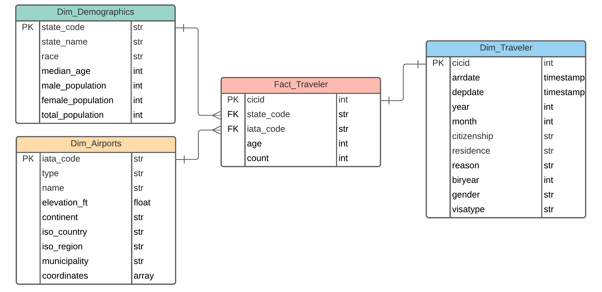
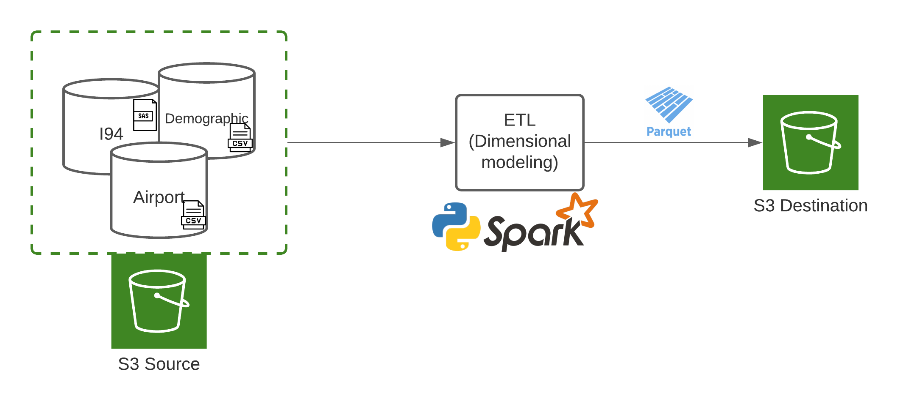

# I94 DataWarehouse - Data Engineering Capstone Project

## Project Summary
The aim of this project is to implement the desing and construction of a data warehouse from I94 dataset. Through this, data will be available to perform analysis and run models to support decision making. By combining different data sources, the idea is to enrich current knowledge of the immigration process to make data actionable.

## Implementation

### Step 1: Scope the Project and Gather Data

#### 1.1 Scope 
In this project, three data sources are joined to understand the immigration process better. The datasets used will be I94 Immigration Data, U.S. City Demographics Data, and Airport Code Table. The Department of Homeland Security (DHS) issues the I94 form to all persons in the U.S. except citizens to control the entrance to the country and for security-related reasons. Therefore, being able to assess and understand the characteristics and analyze the immigration process would benefit the DHS and other organizations. Joining information from the DHS and airports information could enhance the analysis and help the understanding of who travels to the U.S. and which are the most important airports for immigration. Additionally, comparing this with demographic data would allow us to analyze the statistics of the population and how they could affect immigration patterns.

Some of the tools used for this project are AWS S3 (for data storage) and pandas and pyspark (for data exploration and processing).

#### 1.2 Describe and Gather Data 

Following are the data sources used for this project:

|           Dataset          |                                                                                       Description                                                                                       |                                                                                                                                                    Source                                                                                                                                                    | Format |
|:--------------------------:|:---------------------------------------------------------------------------------------------------------------------------------------------------------------------------------------:|:------------------------------------------------------------------------------------------------------------------------------------------------------------------------------------------------------------------------------------------------------------------------------------------------------------:|:------:|
| I94 Immigration Data       | Data from the US National Tourism and Trade Office. Contains international visitor<br>information including demographics and trip specific information as arrival and<br>departure date | [Link](https://classroom.udacity.com/nanodegrees/nd027/parts/dce8f032-1b05-4d57-a30b-d6e41f01e800/modules/c46c3dad-e89f-44a2-9599-b758bfa3a3ba/lessons/b18ab222-552a-432b-aae8-7c52c5e72d37/concepts/7b7f4199-d02b-4684-8e8c-0a58318c62ee#:~:text=in%20the%20workspace.-,This,-is%20where%20the)             | SAS    |
| U.S. City Demographic Data | Contains information about the demographics of US cities                                                                                                                                | [Link](https://classroom.udacity.com/nanodegrees/nd027/parts/dce8f032-1b05-4d57-a30b-d6e41f01e800/modules/c46c3dad-e89f-44a2-9599-b758bfa3a3ba/lessons/b18ab222-552a-432b-aae8-7c52c5e72d37/concepts/7b7f4199-d02b-4684-8e8c-0a58318c62ee#:~:text=OpenSoft.%20You%20can%20read%20more%20about%20it-,here,-.) | CSV    |
| Airport Code Table         | Contains airport information including location (coordinates and city) and height<br>in feet.                                                                                           | [Link](https://classroom.udacity.com/nanodegrees/nd027/parts/dce8f032-1b05-4d57-a30b-d6e41f01e800/modules/c46c3dad-e89f-44a2-9599-b758bfa3a3ba/lessons/b18ab222-552a-432b-aae8-7c52c5e72d37/concepts/7b7f4199-d02b-4684-8e8c-0a58318c62ee#:~:text=It%20comes%20from-,here,-.)                                | CSV    |

### Step 2: Explore and Assess the Data

#### 2.1 Explore the Data

Refer to [CapstoneProject.ipynb](CapstoneProject.ipynb)

#### 2.2 Cleaning Steps

1. Parse I94_SAS_Labels_Descriptions.SAS file to get country code, country name mapping

2. Join `i94cit` and `i94res` field with country name mapping to get country of citizenship and country of residence of immigrants

3. Transform `arrdate`, `depdate` in i94 immigration data from SAS time format to datetime object

4. Select only fields according to dimensional model and rename them accordingly

5. Drop duplicate values from all tables at defined grain level

### Step 3: Define the Data Model
#### 3.1 Conceptual Data Model
This project follows the 4 steps in Kimball's dimensional modeling methodology:
1. **Select the business process:** As discussed in the scope of the project, the main objective is to create a Data Warehouse for support decision making regarding the immigration process. Therefore we focused on the immigration process represented in the data gathered using the i94 form. Through this data model we want to uncover relationships and patterns in migration data collected.

2. **Declare the grain:** The grain will be each i94 form record which corresponds to an immigrant filling the form for a specific visit to the US.

3. **Identify the dimensions:** We defined a `Dim_Demographics` table containing information of the respondent's destination in the US. We also defined a `Dim_Airports` that contain information of the location of different airports around the world. Finally we defined the table `Dim_Traveler` that contains information of the traveler including gender and year of birth among others.

4. **Identify the facts:** The fact table `Fact_Traveler`, contain available facts for this granularity corresponds to the respondent's age (a non-additive fact) and an auxiliar `count` field to perform aggregations.

The dimensional model is depicted as follows:




#### 3.2 Mapping Out Data Pipelines

Raw data is stored in a S3 source bucket from where it will be extracted and transformed to conform a dimensional model for analytics purposes (report generation, statistical modeling, etc.). Transfored dimensional and fact tables are stored into a S3 destination bucket in parquet format. All transformations are performed using python. Data intensive transformations are leveraged using pyspark.



### Step 4: Run Pipelines to Model the Data

#### 4.1 Create the data model

To build the data model the follwong `bash` is run which performs the aforementioned ETL process

``` bash
python etl.py
```

#### 4.2 Data Quality Checks

To ensure the pipeline ran as expected, we included some data quality checks:
 * Assert data schema of every table
 * Assert non-empty tables after running ETL data pipeline
 
To run them use the `bash` command

``` bash
python qa.py
```

#### 4.3 Data dictionary

**Dim_Demographics**

|Field               |Description                                              |
|--------------------|---------------------------------------------------------|
| state_code         | Two letter code to identify state                       |
| state              | US state name                                           |
| race               | Ethnicity                                               |
| median_age         | Median age                                              |
| male_population    | Male population for certain state, city and ethnicity   |
| female_population  | Female population for certain state, city and ethnicity |
| total_population   | Total population for certain state, city and ethnicity  |

**Dim_Airports**

| Field        | Description                                                    |
|--------------|----------------------------------------------------------------|
| iata_code    | International Air Transport Association airport code           |
| type         | Type of airport                                                |
| name         | Name of the airport                                            |
| elevation_ft | Elevation of the airport in feet                               |
| continent    | Continent of the airport                                       |
| iso_country  | ISO three-letter code for the country where airport is located |
| iso_region   | ISO code for the region where airport is located               |
| municipality | City or town where airport is located                          |
| coordinates  | Longitude and latitude of the airport                          |

**Dim_Traveler**

| Field       | Description                                |
|-------------|--------------------------------------------|
| cicid       | Unique immigration identifier for traveler |
| arrdate     | Arival date of the traveler                |
| depdate     | Departure date of the traveler             |
| year        | Year of arrival                            |
| month       | Month of arrival                           |
| citizenship | Country of citizenship of the traveler     |
| residence   | Country of residence of the traveler       |
| reason      | Reason of visiting the US                  |
| biryear     | Birth year of the traveler                 |
| gender      | Gender of the traveler                     |
| visatype    | Visa type                                  |

**Fact_Traveler**

| Field      | Description                                          |
|------------|------------------------------------------------------|
| cicid      | Unique immigration identifier for traveler           |
| state_code | Two letter code to identify state                    |
| iata_code  | International Air Transport Association airport code |
| age        | Age of the traveler                                  |
| count      | Auxiliar variable to count summarize                 |

### Step 5: Complete Project Write Up

#### Tools and technologies
* AWS Simple Storage Service (S3) for raw and processed data storage. Storage on s3 allow to have high volumes of data at relatively low costs. s3 is a good choice for implementing a datalake containing various format data to get staging tables for data modeling
* [`pandas`](https://pandas.pydata.org/) for sample EDA as is one of the most popular packages in data science for data wrangling
* [`pyspark`](https://spark.apache.org/docs/latest/api/python/) for ETL process for its great capability of massive data processing

#### Update frequency
* US Demographics should be updated everytime a new report is available. As census data is costly to get, in most countries it is performed once a few years and estimates updated on a yearly basis. If it is the case data should be updated yearly.

* Airport codes table will have a very low update frequency as changes in this information is strange. Principally when new airports are built, some new records will appear. It would be prudent to update in a yearly basis.

* Immigration data should be updated every month given that raw data seems ti be reported every month. As the granularity for this analysis comes from this source, it is very important to have the most updated data.

* As new data is available, tables should have new inserted rows in contrast to replace existing ones.

#### Scenario considerations

* **The data was increased by 100x:** If data is to big to process in the current ETL pipeline, we could implement massive parallel processing solutions that leverage on Apache Spark in the cloud such as [AWS EMR](https://aws.amazon.com/es/emr/) or [Databricks](https://databricks.com/)

* **The data populates a dashboard that must be updated on a daily basis by 7am every day.** An orchestrator solution such as [Airflow](https://airflow.apache.org/) allows to run pipelines using scheduled ETL jobs on certain time basis. It is possible to define a cron expression to run the ETL process daily at 7 am.

* **The database needed to be accessed by 100+ people:** In the case a great number of people need to access the data, a Datawarehouse solution could be used to allow multiple simultaneous connections such as [AWS Redshift](https://aws.amazon.com/es/redshift/), also a [Datalakehouse](https://databricks.com/product/data-lakehouse) solution can be used to address this problem.

#### Future work

* Improve dimensional model including a separate Date dimension to allow more interesting date grouping.
* Include weather and temperature dimension.
* Implement a Datawarehouse/datalakehouse technology to improve data reading.
* Implement data import into the datawarehouse using DBT.
* Include an orchestrator (e.g. Airflow) to run the pipeline based on new available data.

### Step 6: ETL result demo

Refer to [CapstoneProject.ipynb](CapstoneProject.ipynb)
